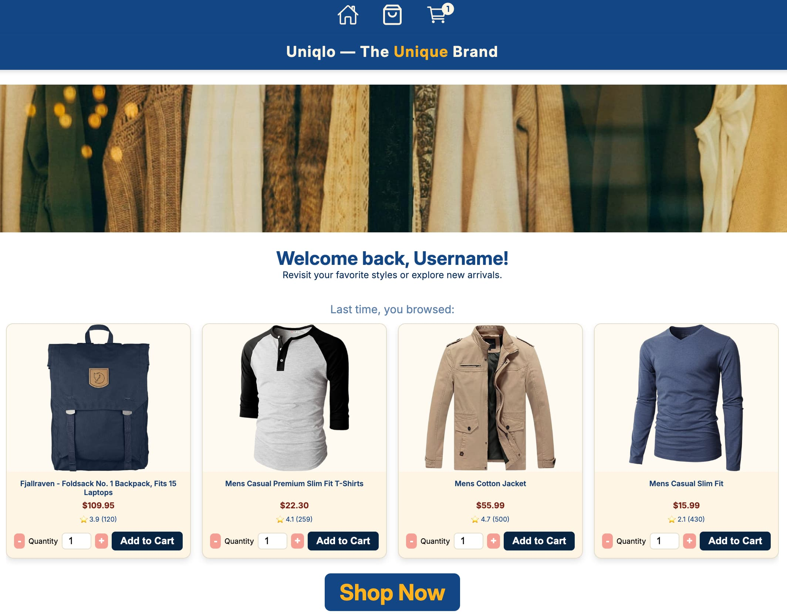

# 🧩 Uniqlo

A Single Page Application for a fake clothing store.

---

## 📖 About the Project

### 🖼️ Preview

<div align='center'>
  
</div>

### 🌐 Live Demo

[Uniqlo Fake Store](https://erreurdesyntaxe.github.io/uniqlo/)

### 🎯 Objective

This project’s goal is to **learn React Router, Data Fetching and React Testing**.

### ✨ Notable Features

- SPA
- Increase/Decrease item quantity
- Cart icon displays numbers of items in cart

### 🧱 Built With

<p align="left">
  
  
  
  
  
  
</p>

---

## ⚙️ Development

This section serves as both a checklist and roadmap.

### 🗒️ To-Do Overview

#### 🧾 Documentation

- [x] Rewrite this README
  - [x] Title
  - [x] Description
  - [x] Objective
  - [x] Notable Features

#### 🧠 Planning

- [x] User stories
- [x] Features
- [x] Flowchart
- [x] Components List
- [x] UI Design / Sketch
- [x] Development Steps

#### 💻 Development Steps

- [x] **Project Setup**

  - [x] Create React project with Vite
  - [x] Install dependencies (React Router, etc.)
  - [x] Create folder structure (components, pages, assets, contexts)
  - [x] Add global CSS file and import it in main.jsx

- [x] **Layout & Navigation**

  - [x] Create Navigation Bar component
  - [x] Create Header and Footer components
  - [x] Implement routing (Home, Shop, Cart)
  - [x] Add cart item count to navigation bar

- [x] **Home Page**

  - [x] Add placeholder hero image or banner
  - [x] Add welcome message / introduction text
  - [x] Add previously browsed items

- [x] **Shop Page**

  - [x] Fetch products from FakeStore API
  - [x] Create Loading Spinner component
  - [x] Create Error Message component
  - [x] Create Product Card component
    - [x] Show product image, title, price
    - [x] Add quantity input with + / - buttons
    - [x] Add "Add to Cart" button
  - [x] Create SearchBar component
    - [x] Filter products by name in real time
  - [x] Handle adding items to cart and updating cart count

- [x] **Cart Page**

  - [x] Create Cart component
    - [x] Display all items in the cart
    - [x] Show quantities, individual price, total price
    - [x] Allow increment/decrement of quantities
    - [x] Allow removing individual items
    - [x] Add "Clear Cart" button
  - [x] Update cart state in real time

- [x] **State Management**

  - [x] Set up global state using useReducer / context API
  - [x] Handle adding/removing items and quantity changes
  - [x] Persist cart state across page navigation

- [x] **Styling**

  - [x] Create CSS Modules for components
  - [x] Apply custom fonts (Inter / Rubik) via global.css
  - [x] Style navigation bar, buttons, product cards, and cart
  - [x] Add responsive styles for desktop and mobile

- [x] **User Feedback & UX**

  - [x] Show loading spinner while fetching products
  - [x] Show error message if API fails
  - [x] Show confirmation/visual feedback when adding to cart

- [x] **Testing & Optimization**
  - [x] Test navigation between pages
  - [x] Test cart functionality (add, remove, clear, update quantities)
  - [x] Test search functionality
  - [x] Check mobile responsiveness
  - [x] Run basic accessibility checks

#### 🚀 Deployment (Git + GitHub Pages)

- [x] `npm install --save-dev gh-pages`
- [x] Add `"homepage": "https://erreurdesyntaxe.github.io/uniqlo/"` script
- [x] Add `"deploy": "gh-pages -d dist"` script
- [x] Add `base: '/<repo>/'` to vite.config.js
- [x] Add basename to BrowserRouter
- [x] `npm run build`
- [x] Commit all changes on main
- [x] `npm run deploy`

#### 🪞 Final Review

- [x] Update Live Page Link
- [x] Update Project Preview Image
- [x] Confirm Built With section
- [x] Add Reflection

---

## 👥 User Stories

- As a user, I want to navigate from any page to any page (home, shop, cart)
- As a user, I want to see the products clearly
- As a user, I want to input how many of an item I want right on the product card
- As a user, I want to click buttons to increase or decrease the quantity
- As a user, I want to add/remove any item to/from my cart
- As a user, I want to clear my whole cart with one click
- As a user, I want to add 1 item by default
- As a user, I want to see how many items are in my cart from the cart icon
- As a user, I want to have feedback when adding an item
- As a user, I want to see the total price of my cart when on the cart page
- As a user, I want to see a loading indicator
- As a user, I want to see an error message if adding fails
- As a user, I want to search items by name

---

## 🧩 Features

- Users can **navigate seamlessly** between the Home, Shop, and Cart pages using a persistent navigation bar.
- Users can **browse products clearly** displayed with images, titles, and prices fetched from the FakeStore API.
- Users can **select quantities easily** with both manual input fields and increment/decrement buttons.
- Users can **add and remove items** from the cart at any time, with real-time updates to cart contents and totals.
- Users can **clear the entire cart** in one click using the “Clear Cart” button.
- Users can **add 1 item by default** when adding a new product to the cart for quick and simple additions.
- Users can **see a live cart counter** in the navigation bar that updates instantly as items are added or removed.
- Users receive **visual feedback** (such as alerts or animations) when an item has been added to the cart.
- Users can **view a detailed cart summary** showing itemized products, quantities, and a running total price.
- Users see a **loading spinner** while products are being fetched from the API.
- Users see an **error message** if fetching or adding items fails.
- Users can **search products by name** directly from the Shop page.

---

## 🧭 Flowchart

Page Loads  
→ App component renders  
→ Navigation Bar and Footer appear on all pages  
→ User lands on **Home Page** by default

Home Page  
→ User can click **Shop** or **Cart** in the navigation bar  
→ Clicking **Shop** navigates to Shop Page

Shop Page  
→ Loading Spinner appears while fetching products from FakeStore API  
→ If fetch succeeds → Product Cards render  
→ If fetch fails → Error Message displays  
→ Each Product Card shows image, title, price, and quantity controls  
→ User types or adjusts quantity (+ / –)  
→ User clicks **Add to Cart**  
→ Cart state updates (via useReducer)  
→ Cart icon in Navigation Bar updates count in real time  
→ Success feedback appears (e.g., toast message)

Cart Page  
→ Displays all items currently in the cart  
→ User can increase/decrease quantities or remove items  
→ User can click **Clear Cart** to remove all items  
→ Total price recalculates automatically  
→ Cart icon count updates instantly

Search Flow  
→ User types into **Search Bar** on Shop Page  
→ Product list filters in real time by matching product names  
→ Clearing the search input restores the full product list

Navigation Flow  
→ Navigation Bar allows switching between Home, Shop, and Cart at any time  
→ State (cart contents, search query) persists across pages during the session

---

## 🏗️ Components

- App
- Store
- Header
- Navigation Bar
- Search Bar
- Loading Spinner
- Cart
- Cart Item
- Product Card
- Footer
- Error Message

---

## UI Mock-Up

### Home Page

```
+--------------------------------------------------------------+
| 🛍️ MyShop [Home] [Shop] [Cart (3)] |
+--------------------------------------------------------------+

[ Hero Image or Welcome Message ]

| 🏠 Home Page                                                |
| ----------------------------------------------------------- |
| Welcome to MyShop!                                          |
| Browse our selection of products in the Shop page.          |
| ----------------------------------------------------------- |

[ Footer © 2025 MyShop ]
```

### Shop Page

```
+--------------------------------------------------------------+
| 🛍️ MyShop [Home] [Shop] [Cart (2)] |
+--------------------------------------------------------------+
| 🔍 Search: [_____________] |
+--------------------------------------------------------------+
| [🧴 Product 1] [👕 Product 2] [🎧 Product 3] [📚 Product 4] |
| Price: $12.99 Price: $24.99 Price: $59.99 Price: $9.99 |
| [ - ] [ 1 ] [ + ] [Add] [ - ] [ 1 ] [ + ] [Add] ... |
+--------------------------------------------------------------+
| ✅ Product added! |
[ Footer © 2025 MyShop ]
```

### Cart Page

```
+--------------------------------------------------------------+
| 🛍️ MyShop [Home] [Shop] [Cart (2)] |
+--------------------------------------------------------------+
| Product Qty Price Total |
| ----------------------------------------------------------- |
| 👕 Product 2 2 24.99 49.98 [ - ] [ + ] [x] |
| 🎧 Product 3 1 59.99 59.99 [ - ] [ + ] [x] |
| ----------------------------------------------------------- |
| Total: $109.97 [Clear Cart]
```

## 🧠 Reflexion

Vite’s SVG handling can be tricky. It was simpler to edit the SVG files directly than to style them via CSS imports. Another hiccup was with the favicon SVGs. They must be referenced from the /uniqlo/ path (the project’s root) to avoid 404s.
